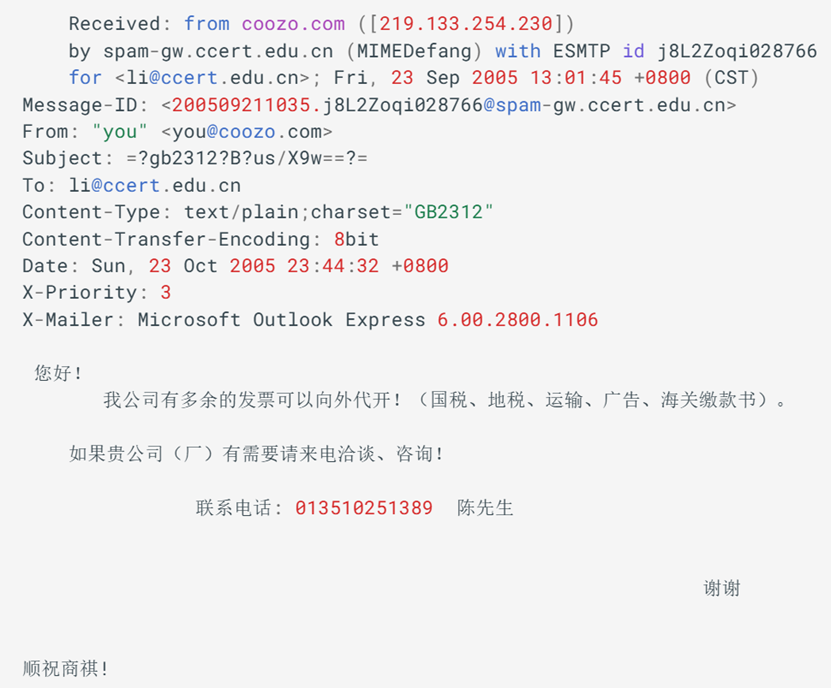
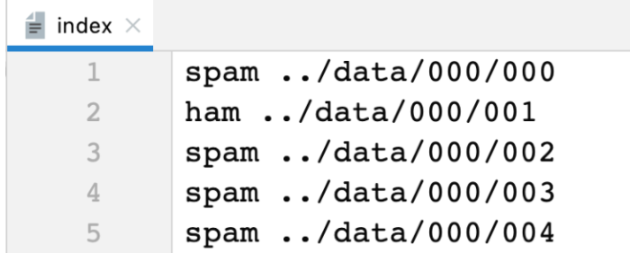

-----------------------------------
这是一个 中文垃圾邮件 分类项目

一.邮件内容

根据full目录下的index来合并邮件

二、src解释：

data.py：
    邮件数据是以单个文件的方式存储，我们将所有的邮件数据从文件读取出来，
    并转存到一个 csv 文件中文件数据大概有64620条，这个过程大概10分钟

    接着我们对这些数据进行清洗，包括：去掉中文字符、繁体转简体、分词再筛选需要的词性
    然后我们得到了我们需要的词性和其对应的邮件类型：上海 课程 财务 莆窆 ...  spam
    这个过程大概15分钟

    接着进行特征提取 CountVectorizer：统计每个词在文本中出现的次数（词袋模型，Bag of Words）。
    fit_transform：保留前 10000 个高频词，然后把每条文本转成一个固定长度（10000维）的稀疏向量，向量的每个位置代表某个词是否出现、出现几次。
    对于传统 机器学习模型（如逻辑回归、SVM、朴素贝叶斯），必须先把文本转为数值向量，但是仅基于词频，语义上没有联系
    对于 深度学习模型，直接用 词嵌入层（Embedding） 或者预训练模型（如 BERT），学习得到的向量能表达语义关系
    然后到这里我们数据基本上都处理完毕了，2 8 比例切分一下测试集和训练集，然后保存为 pickle 文件，准备训练模型。
    pkl → 适合保存训练中间产物（稀疏矩阵、特征字典、模型对象）最合适。
    csv/json → 适合保存人类可读的数据（原始文本、清洗后的标签、结果日志）。

model.py：
    训练模型，这里使用的是朴素贝叶斯算法，gpu训练瞬间完成
    然后对测试集进行评估，输出准确率、精确率、召回率
    最后的模型预测我没写，具体就是拿到邮件，然后经过 清洗、特征处理、向量转化、输入模型，得到结果。

部署：
    部署后，新邮件一样要经过 清洗 → 分词/向量化 → 输入模型。
    向量器必须是训练时保存下来的 同一份对象，保证特征维度对应一致。
    模型和向量器通常一起保存/加载。

三、待完善
    在数据清洗阶段我写的不好，应该把清洗的步骤写的更加清晰一点
    这样新的预测邮件进来可以直接 清晰、预测、输出结果，有时间再完善吧